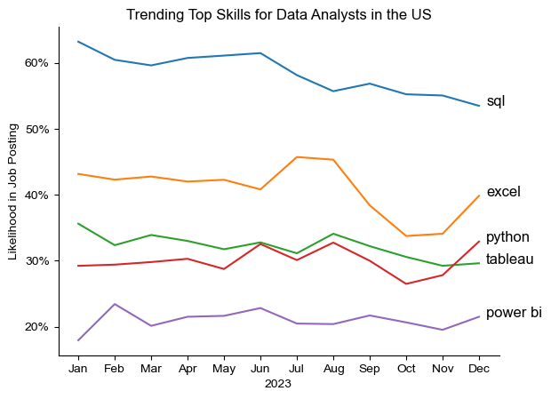

# Overview

As someone new to the data analytics field, I started learning Python and wanted to apply my skills to a real-world dataset. I followed [Luke Barousse's Python course](https://www.lukebarousse.com/python) and built this project to understand the job market for data roles, especially for data analysts. This project helped me explore what makes a data analyst role in-demand, what skills are important, and how salaries vary by skill.

I used Python to clean and analyze the dataset, then visualized the results to answer key questions about the most requested and highest-paying skills. This was also a great way for me to improve my data cleaning, plotting, and storytelling skills. It reflects my learning from beginner level to someone who can now complete a full data project.

# Project Questions

1. What are the skills most in demand for the top 3 most popular data roles?
2. How are in-demand skills trending for Data Analysts?
3. How well do jobs and skills pay for Data Analysts?
4. What are the optimal skills for data analysts to learn? (High Demand AND High Paying)

# Tools Used

* Python – My main tool for all data analysis

    * Pandas – For working with and transforming the data

    * Matplotlib & Seaborn – For building charts and visualizations

* Jupyter Notebooks – To write code and see results step by step

* Visual Studio Code – My main editor for writing and testing code

* Git & GitHub – For version control and sharing the project online

# Data Preparation and Cleanup

I started by loading the dataset from Hugging Face and cleaning it. I converted the date column and made sure the job skills were in list format for analysis.

## Import & Clean Up Data

```python
# Importing Libraries
import ast
import pandas as pd
import seaborn as sns
from datasets import load_dataset
import matplotlib.pyplot as plt  
```

# Loading Data
```
dataset = load_dataset('lukebarousse/data_jobs')
df = dataset['train'].to_pandas()
```

# Data Cleanup
```
df['job_posted_date'] = pd.to_datetime(df['job_posted_date'])
df['job_skills'] = df['job_skills'].apply(lambda x: ast.literal_eval(x) if pd.notna(x) else x)
```


# Filter US Jobs

Then, I filtered the data to only include jobs in the United States.

```python
df_US = df[df['job_country'] == 'United States']
```


# The Analysis

## 1. Most In-Demand Skills for Top 3 Data Roles

I found the 3 most common roles in the dataset and listed their top 5 most requested skills. This helped me understand which tools and languages are important for each job title.

View my notebook with detailed steps here:
[2_skill_Demand.ipynb](2_Skills_Demand.ipynb)

### Visualize Data

```python
fig, ax = plt.subplots(len(job_titles), 1)

sns.set_theme(style='ticks')

for i, job_title in enumerate(job_titles):
    df_plot = df_skills_perc[df_skills_perc['job_title_short'] == job_title].head(5)
    sns.barplot(data=df_plot, x='skill_percent', y='job_skills', ax=ax[i], hue='skill_count', palette='dark:b_r')
    ax[i].set_title(job_title)
    ax[i].set_ylabel('')
    ax[i].set_xlabel('')
    ax[i].legend().remove()
    ax[i].set_xlim(0, 78)

    for n, v in enumerate(df_plot['skill_percent']):
         ax[i].text(v + 1, n, f'{v:.0f}%', va='center')

    if i != len(job_titles) - 1:
        ax[i].set_xticks([])

fig.suptitle('Likelihood of Skills Requested in US Job Posting', fontsize=15)
fig.tight_layout(h_pad=0.5) # fix the overlap
plt.show()
```


### Results


*Bar graph visualizing the salary for the top 3 data roles and their top 5 skills associated with each.*

### Insights

* SQL is the top skill for Data Analysts and Data Engineers.

* Python is the most in-demand skill for Data Scientists.

* Data Engineers often require more technical cloud skills like AWS and Spark.

## 2. Trending Skills for Data Analysts in 2023

I looked at how skill demand changed month by month for Data Analyst roles.

View my notebook with detailed steps here:
[3_Skills_Trend.ipynb](3_Skills_Trend.ipynb)

### Visualize Data

```python
df_plot = df_DA_US_percent.iloc[:, :5]

sns.lineplot(data=df_plot, dashes=False, palette='tab10')
sns.set_theme(style='ticks')
sns.despine()

plt.title('Trending Top Skills for Data Analysts in the US')
plt.ylabel('Likelihood in Job Posting')
plt.xlabel('2023')
plt.legend().remove()

from matplotlib.ticker import PercentFormatter
ax = plt.gca()
ax.yaxis.set_major_formatter(PercentFormatter(decimals=0))

for i in range(5):
    plt.text(11.2, df_plot.iloc[-1, i], df_plot.columns[i])
```

### Results



*Bar graph visualizing the trending top skills for data analysts in the US in 2023.*

### Insights

* SQL stayed in high demand all year.

* Excel grew in popularity near the end of 2023.

* Python and Tableau stayed fairly consistent throughout the year.

## 3. Salary Analysis for Data Roles

I used box plots to understand salary ranges for different job titles. Then, I focused on Data Analyst roles to compare the top-paying skills and most frequently requested skills.


View my notebook with detailed steps here: [4_Salary_Analysis](4_Salary_Analysis.ipynb)

### Visualize Data

```python
sns.boxplot(data=df_US_top6, x='salary_year_avg', y='job_title_short', order=job_order)
sns.set_theme(style='ticks')

# this is all the same
plt.title('Salary Distribution in the United States')
plt.xlabel('Yearly Salary ($USD)')
plt.ylabel('')
plt.xlim(0, 600000)
ticks_x = plt.FuncFormatter(lambda x, pos: f'${int(x/1000)}K')
plt.gca().xaxis.set_major_formatter(ticks_x)
plt.show()
```


### Results


*Box plot visualizing the salary distributions for the top 6 data job titles.*

### Insights

* Senior roles like Senior Data Scientist and Senior Data Engineer showed the highest salary potential, sometimes going up to $600K.

* These senior roles also had a wide salary range and many outliers, meaning that exceptional skills or companies can lead to very high pay.

* Data Analyst roles had a more stable salary range, showing consistency in how much they are paid.

### Highest Paid & Most Demanded Skills for Data Analysts

Next, I used two bar charts to compare:

* The top 10 highest-paid skills for Data Analysts

* The top 10 most in-demand skills for Data Analysts

### Visualize Data

```python
fig, ax = plt.subplots(2, 1)

sns.set_theme(style="ticks")

# Top 10 Highest Paid Skills for Data Analysts
sns.barplot(data=df_DA_top_pay, x='median', y=df_DA_top_pay.index, ax=ax[0], hue='median', palette='dark:b_r')
ax[0].legend().remove()

# df_DA_top_pay[::-1].plot(kind='barh', y='median', ax=ax[0], legend=False)
ax[0].set_title('Top 10 Highest Paid Skills for Data Analysts')
ax[0].set_ylabel('')
ax[0].set_xlabel('')
ax[0].xaxis.set_major_formatter(plt.FuncFormatter(lambda x, _: f'${int(x/1000)}K'))

# Top 10 Most In-Demand Skills for Data Analysts
sns.barplot(data=df_DA_skills, x='median', y=df_DA_skills.index, ax=ax[1], hue='median', palette='light:b')
ax[1].legend().remove()

# df_DA_skills[::-1].plot(kind='barh', y='median', ax=ax[1], legend=False)
ax[1].set_title('Top 10 Most In-Demand Skills for Data Analysts')
ax[1].set_ylabel('')
ax[1].set_xlabel('Median Salary (USD)')
ax[1].set_xlim(ax[0].get_xlim()) # Set the same x-axis limits as the first plot
ax[1].xaxis.set_major_formatter(plt.FuncFormatter(lambda x, _: f'${int(x/1000)}K'))

fig.tight_layout()
plt.show()
```

### Results


*Two separate bar graphs visualizing the highest paid skills and most in-demand skills for data analysts in the US.*

### Insights

* Some less common technical skills like GitLab, Bitbucket, and dplyr had very high salaries, showing that niche or advanced tools can be financially rewarding.

* Common tools like Excel, PowerPoint, and SQL appeared in many job postings but offered lower median salaries.

* There’s a clear difference between skills that are in demand vs. those that pay well. Learning a mix of both can help you stand out and increase your earning potential.

## 4. Best Skills to Learn for Data Analysts

I created a scatter plot comparing salary and demand for each skill. This helped identify the most valuable skills that offer a good balance of high demand and strong salary.

View my notebook with detailed steps here: [5_Optimal_Skills](5_Optimal_Skills.ipynb)

### Visualize Data

```python
from adjustText import adjust_text

df_DA_skills_high_demand.plot(kind='scatter', x='skill_percent', y='median_salary')

# Prepare texts for adjustText
texts = []
for i, txt in enumerate(df_DA_skills_high_demand.index):
    texts.append(plt.text(df_DA_skills_high_demand['skill_percent'].iloc[i], df_DA_skills_high_demand['median_salary'].iloc[i], txt))

adjust_text(texts, arrowprops=dict(arrowstyle='->', color='gray'))

# Set axis labels, title, and legend
plt.xlabel('Percent of Data Analyst Jobs')
plt.ylabel('Median Yearly Salary')
plt.title('Most Optimal Skills for Data Analysts in the US')

from matplotlib.ticker import PercentFormatter
ax = plt.gca()
ax.yaxis.set_major_formatter(plt.FuncFormatter(lambda y, pos: f'${int(y/1000)}K'))
ax.xaxis.set_major_formatter(PercentFormatter(decimals=0))

# Adjust layout and display plot 
plt.tight_layout()
plt.show()
```

### Results


*A scatter plot visualizing the most optimal skills (high paying & high demand) for data analysts in the US.*

### Insights

* Python, Tableau, and SQL Server are great skills to learn due to their balance of demand and pay.

* Oracle had a high salary but low demand.

* Excel and PowerPoint were widely requested but had lower salaries.


## Visualizing Different Technologies

Let's visualize the different technologies as well in the graph. We'll add color labels based on the technology (e.g., {Programming: Python})

Visualize Data

```python
from adjustText import adjust_text

# df_plot.plot(kind='scatter', x='skill_percent', y='median_salary')
sns.scatterplot(
    data=df_plot,
    x='skill_percent',
    y='median_salary',
    hue='technology'
)

sns.despine()
sns.set_theme(style='ticks')

# Prepare texts for adjustText
texts = []
for i, txt in enumerate(df_DA_skills_high_demand.index):
    texts.append(plt.text(df_DA_skills_high_demand['skill_percent'].iloc[i], df_DA_skills_high_demand['median_salary'].iloc[i], txt))

# Adjust text to avoid overlap
adjust_text(texts, arrowprops=dict(arrowstyle='->', color='gray'))

# Set axis labels, title, and legend
plt.xlabel('Percent of Data Analyst Jobs')
plt.ylabel('Median Yearly Salary')
plt.title('Most Optimal Skills for Data Analysts in the US')
plt.legend(title='Technology')

from matplotlib.ticker import PercentFormatter
ax = plt.gca()
ax.yaxis.set_major_formatter(plt.FuncFormatter(lambda y, pos: f'${int(y/1000)}K'))
ax.xaxis.set_major_formatter(PercentFormatter(decimals=0))

# Adjust layout and display plot 
plt.tight_layout()
plt.show()
```

### Results


*A scatter plot visualizing the most optimal skills (high paying & high demand) for data analysts in the US with color labels for technology.*


### Insights


* Programming skills (colored blue) tend to appear near the top in terms of salary, showing that technical coding skills are financially rewarding.

* Database skills (colored green), such as Oracle and SQL Server, also appear near the top for salary, even if demand is lower.

* Analyst tools (colored orange), like Tableau, Excel, and Power BI, are more common in job listings but generally offer lower median salaries.

# What I Learned

This project helped me understand both Python and the job market better. I practiced:

* Using Python libraries to load, clean, and analyze data

* Building charts with Matplotlib and Seaborn

* Telling a story with data by combining insights and visuals

* Finding patterns between skill demand and salary for better career planning

# Insights

This project provided several general insights into the data job market for analysts:

* Skill Demand and Salary Correlation: There is a clear correlation between the demand for specific skills and the salaries these skills command. Advanced and specialized skills like Python and Oracle often lead to higher salaries.

* Market Trends: There are changing trends in skill demand, highlighting the dynamic nature of the data job market. Keeping up with these trends is essential for career growth in data analytics.

* Economic Value of Skills: Understanding which skills are both in-demand and well-compensated can guide data analysts in prioritizing learning to maximize their economic returns.

# Challenges I Faced

Since I'm still learning, I ran into a lot of questions and doubts while building this project. Some specific challenges I faced include:

* Understanding how explode() works to split list data

* Figuring out .iloc indexing and how to access specific rows and columns.

* Data Inconsistencies: Handling missing or inconsistent data entries requires careful consideration and thorough data-cleaning techniques to ensure the integrity of the analysis.

* Complex Data Visualization: Designing effective visual representations of complex datasets was challenging but critical for conveying insights clearly and compellingly.

* Balancing Breadth and Depth: Deciding how deeply to dive into each analysis while maintaining a broad overview of the data landscape required constant balancing to ensure comprehensive coverage without getting lost in details.

But each problem taught me something. I now feel more confident working real-data problems using Python.


# Conclusion

This project helped me connect the dots between technical skills and job market needs. I now understand which tools are most useful for data analysts, and how salary and demand go hand in hand. It also improved my confidence with Python and data visualization.

While I’m still learning, this is a big step forward for me. I’m excited to continue building projects and keep growing in the data field.